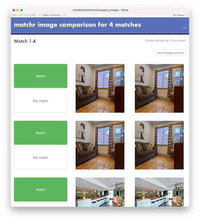
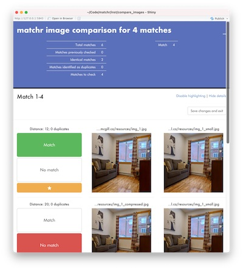

```{r, include = FALSE}
knitr::opts_chunk$set(
  collapse = TRUE,
  comment = "#>"
)
```

The goal of matchr is to facilitate fast and reliable comparison of large sets of images to identify identical or nearly-identical pairs. It works by generating distinctive image signatures from pixel data then correlating these signatures between sets of images. matchr's approach allows for image comparisons to be made on large sets of images (tens or hundreds of thousands of files) on even modest computer hardware. This introductory vignette demonstrates the standard matchr workflow, from importing images and generating signatures to identifying and refining matches.

```{r setup, include = FALSE}
library(matchr)
```

```
library(matchr)
```

## How matchr's image matching works

If two image files are identical at the byte level, comparing them is trivial. The motivation for matchr's development, by contrast, was the need to compare images hosted by web services that compress and resize uploads differently. In other words, when the same exact file is uploaded to two services, the resulting files may be visually identical but completely different byte-to-byte. In addition, the same underlying image may be modified in slightly different ways before being uploaded to different services (e.g. with a small text overlay, or with a change to tint or contrast). A human could identify the images as the same, but again the byte-level data will be different. matchr is designed to solve these problems at large scale and efficiently, so that hundreds of thousands of images can be compared even on a laptop with minimal CPU power and RAM.

The strategy matchr uses is to extract relatively small but expressive "signatures" from each image, and compare these signatures mathematically. These signatures are "perceptual hashes" generated with the {OpenImageR} package. The perceptual hashing implementation used here downsamples images into 8x8 greyscale bitmaps, and then applies a discrete cosine transformation to each pixel and identifies pixels which are above or below the overall mean. matchr performs this operation twice (in slightly different ways) for each image, and uses the resulting 128-bit binary number as an image signature. This signature can identify a given image even if the image is rescaled, compressed or has a small overlay added to it, and thus serves as a reliable indicator of whether two images are the same.

Once image signatures have been generated for a set of images, matchr uses matrix algebra to compare each signature against each other signature using Hamming distances to identify potential matches. The Hamming distance measures the number of characters or bits of two strings or binary numbers which are different from each other. For matchr, the lower the Hamming distance, the closer the image signatures are to being identical, and thus the higher the likelihood that the underlying images are the same.

matchr has two comparison modes. If you supply a single set of images to its functions, matchr will identify all potential pairwise matches within that set. E.g., for a input vector `x`, it may determine that `x[1]` and `x[4]` are potential matches, along with `x[2]` and `x[3]`. If you supply two sets of images, by contrast, matchr will identify all potential pairwise matches *between* the two sets. E.g., for input vectors `x` and `y`, it may identify `x[1]` and `y[2]` as matches, but it will *not* identify `x[1]` and `x[4]`.

Since some true matches will inevitably have lower Hamming distances than some non-matches (because, e.g., the same image was de-saturated then compressed in one image set and left untouched in the other set), there is no possible "magic" threshold which is guaranteed to identify all true positives and exclude all true negatives. The parameters matchr uses to identify potential matches can be modified at will, but the defaults are tuned to produce very few false negatives, at the cost of producing somewhat more false positives. In other words, the default use case is based on the assumption that nearly every single match needs to be identified. For this reason, matchr provides an interactive Shiny app which can be used to manually verify the results of the automated matching process. The [performance vignette](performance.html) discusses the image matching parameters in greater detail, and provides sensible defaults for different use cases.

## Quick start

The simplest way to compare image sets with matchr is to use `match_images`, which is a convenience wrapper around the main functions in a standard matchr workflow. It does not allow much customization of parameters and doesn't scale well to extremely large image sets, but is a good choice when you just want to quickly identify duplicate images.

Here we demonstrate `match_images` being run on a single vector of internet images, using the `example_urls` data object included in matchr:

```{r paths}
example_urls
```

```{r modify_urls_and_make_custom_functions, echo = FALSE}
# This is necessary to allow the vignette to build offline and still give proper
# error messages

# Start by replacing example_urls with links to local resources
display_urls <- example_urls
example_urls <- list.files(here::here("tests", "testthat", "resources"), 
                           full.names = TRUE)
example_urls <- example_urls[1:15]

# Next overwrite match_images and load_images to give a different warning
match_images <- function(...) {
  tryCatch(matchr::match_images(...), warning = function(w) {
    warning(paste0("Input 'https://upgo.lab.mcgill.ca/resources/img_2_",
                   "corrupt.jpg' is invalid; output is NA."), call. = FALSE)
    suppressWarnings(matchr::match_images(...))
  }) 
}

load_image <- function(...) {
  tryCatch(matchr::load_image(...), warning = function(w) {
    warning(paste0("Input 'https://upgo.lab.mcgill.ca/resources/img_2_",
                   "corrupt.jpg' is invalid; output is NA."), call. = FALSE)
    suppressWarnings(matchr::load_image(...))
  }) 
}

```

`match_images` takes a `compare` argument, which controls whether the interactive `compare_images` Shiny app should be run to manually verify match results. This can only be run in an interactive session, so for the vignette `compare` is set to `FALSE`.

```{r match_images}
all_matches <- match_images(example_urls, compare = FALSE)
```

The results are returned as a data frame in which each row is a pairwise match between two of the input images. The function also generated a warning that one of the imported images was invalid. ("img_2_corrupt.jpg" is a purposely corrupted image, included in the test set to demonstrate what happens when matchr encounters an image it can't read.) 

```{r match_images_edit, echo = FALSE}
all_matches$x_path <- display_urls[c(10, 1, 1, 2, 6, 8)]
all_matches$y_path <- display_urls[c(11, 2, 3, 3, 7, 9)]
```

```{r match_images_display}
all_matches
```

The data frame has six rows, which correspond to six matches among the fifteen images in `test_urls`. The "x_path" and "y_path" fields show the file paths or URLs of the images which were matched. The next two fields ("x_sig" and "y_sig") contain the `matchr_signature` image signature vectors for the images which were matched. These vectors contain the image signatures used for matching, alongside other metadata from the images such as resolution, colour channels, and file path. The final field ("distance") gives a modified version of the Hamming distance between the image signatures of the two matching images, with lower values meaning the two images are more likely to be the same. If `match_images` is run with its default `compare = TRUE` setting, using the interactive image comparison Shiny app to manually confirm the results of the matching process will add `match` and `highlight` fields to the output data frame, which respectively identify image pairs whose status ("match" or "no match") was visually confirmed and image pairs flagged for further follow up.

Image comparison in matchr (either in `match_images` or the component functions) can identify matches within a single image set (as demonstrated above) or can identify matches between two image sets. This latter mode simply requires passing two input vectors to the functions:

```{r match_images_xy}
match_images(example_urls[1:7], example_urls[8:15], compare = FALSE)
```

In this case no matches were found, so the output data frame is empty.

Because `match_images` provides a streamlined wrapper around the entire matchr workflow, it is convenient for quickly identifying matches from small image sets, but it does not scale well to more complicated image matching tasks. The remainder of this vignette provides a step-by-step guide to the functions which `match_images` calls internally, and which will generally be used directly on image sets in real-world tasks. The standard matchr workflow generally looks like this:

- Use `load_images` on a vector of file paths or URLs to read image files into memory as a `matchr_image` vector. (This step is only feasible for small image sets.)
- Use `create_signatures` on a `matchr_image` vector (or more likely a vector of file paths for large image sets) to generate a `matchr_signature` vector containing distinctive image signatures.
- Use `match_signatures` on one or two `matchr_signature` vectors to generate a `matchr_matrix` vector of matrices containing a measure of similarity between each pair of images (the Hamming distance).
- Use `identify_matches` on a `matchr_matrix` vector to identify pairs of images which are likely to be the same.
- Use `confirm_matches` on the result data frame produced by `identify_matches` to load an interactive Shiny app for visually confirming ambiguous match candidates.
- Use `integrate_changes` to add the results of the visual confirmation to the result data frame.

## Loading images

The first step in a matchr workflow is importing images, either directly as `matchr_image` vectors which contain arrays of pixel values, or indirectly en route to generating the `matchr_signature` image signature vectors used for subsequent steps. matchr can import bitmapped images in the JPEG, PNG, TIFF, and BMP file formats. Images can be identified in two ways:

- As a character vector of URLs or local file paths
- As a length-one character vector containing the path to a local directory containing images

For small image sets such as `example_urls`, we can read the images directly into memory using `load_image`. 

```{r load_image}
img <- load_image(example_urls)
```

```{r load_image_edit, echo = FALSE}
get_path(img) <- display_urls
```

This will create a `matchr_image` vector, each element of which is an array of pixel values. Invalid file paths will produce `NA` values, which will be passed through subsequent matchr functions without "infecting" other results. (I.e., unlike `sum`, which will return `NA` if any inputs are `NA`, matchr functions will ignore `NA` inputs during processing while reporting on the presence of `NA` elements in a fashion appropriate for the given function.) The print method for `matchr_image` vectors displays the resolution, colour profile, and file path of each image.

```{r img}
img
```

One reason to load entire images into memory with `load_image` rather than to just generate image signatures directly from the file paths with `create_signature` is to be able to conveniently see the images themselves. By default, the `plot` method for `matchr_image` vectors will display the first 12 non-NA images in the vector in a grid, along with their file names. Here we set the `max_plot` argument to 15 to show all the non-NA images in the vector.

```{r plot_img, fig.height = 6, fig.width = 6}
plot(img, max_plot = 15)
```

Since the `matchr_image` vectors contain raw arrays of pixel values, it is also possible to apply linear transformations directly to the arrays:

```{r transform_img, fig.height = 5, fig.width = 6}
img_cube <- img[c(1, 5)]
img_root <- img[c(1, 5)]
# Get or set values "inside" matchr vectors with the get_* functions
get_array(img_cube) <- lapply(get_array(img_cube), \(x) x ^ 3)
get_path(img_cube) <- c("img_1 cube", "img_3 cube")
get_array(img_root) <- lapply(get_array(img_root), sqrt)
get_path(img_root) <- c("img_1 root", "img_3 root")
plot(c(img[c(1, 5)], img_cube, img_root))
```

In standard matchr workflows which involve comparing large sets of images, it will rarely be feasible to use `load_image`, given the enormous size of the pixel arrays in memory. (See [the performance vignette](performance.html) for more information.) Instead, `create_signature` can process image sets in batches, reading a small number of images into memory at a time, identifying their distinctive image signatures, and then allowing them to be released from memory before beginning the next batch. This allows arbitrarily large sets of images to be processed by matchr on even relatively modest hardware.

## Creating signatures

The workhorse data structure in matchr is the `matchr_signature` vector of distinctive image signatures calculated from a set of images. These signatures are created using the `create_signature` function, which has methods both for `matchr_image` vectors imported with `load_image` and for a character vector of file paths, which will be sent in batches through a `load_image`-`create_signature` process designed to keep total memory requirements low. Since we already imported a vector of images in the previous section, we can pass this vector as an input to `create_signature`:

```{r create_signature_image}
sig <- create_signature(img)
sig
```

`matchr_signature` vectors print as a string of hexadecimal characters alongside some metadata. These characters represent the values of two 64-bit "perceptual hashes", which can identify images with a high degree of accuracy even in the face of small changes. (See [the matching vignette](matching.html) for more information.) The individual bits of the hashes can be accessed with `get_hash`:

```{r get_signature}
get_hash(sig[1])
```

Using the `plot` method for `matchr_signature` vectors, the signatures can be visualized as follows:

```{r col_img, fig.height = 5, fig.width = 6}
plot(sig)
```

The plot reveals strong similarities between, e.g., the three "img_1" signatures—all of which are in fact taken from variants of the same image.

### Removing black bars

A relatively common phenomenon with user-uploaded photographs is horizontal black bars above and below an image. These occur when users take a screenshot of a landscape-oriented photograph and upload the result. The `example_urls` image set contains one such image:

```{r rm_black_bars_1, fig.height = 3, fig.width = 3}
plot(img[13])
```

These images pose a difficulty for matchr's image signature strategy, because they lead to signatures dominated by black values. Because matchr was motivated by the need to compare large numbers of user-uploaded photographs across different web services, it has the ability to detect and remove horizontal black bars, using the `remove_black_bars` function or the `rm_black_bars` argument to `create_signature`, which is TRUE by default. `remove_black_bars` takes a matchr_image vector, detects and removes black bars, and returns an updated vector:

```{r rm_black_bars_2, fig.height = 5, fig.width = 6}
bb_img <- remove_black_bars(img[13])
get_path(bb_img)[[1]] <- "Black bars removed"
plot(c(img[13], bb_img))
```

When `create_signature` is called with `rm_black_bars = TRUE`, image signatures are only generated from the portion of images which do not have rows of entirely black pixels:

```{r rm_black_bars_3, fig.height = 2, fig.width = 6}
bb_sig <- create_signature(img[13], rm_black_bars = FALSE)
get_path(bb_sig)[[1]] <- "Black bars not removed"
plot(c(bb_sig, sig[13]))
```

## Matching signatures

Once image signatures have been generated, they can be compared to each other using Hamming distances, which use the bit-wise distance between signatures to assess the likelihood that the underlying images are the same. This measurement is carried out with `match_signatures`, which can take either one or two `matchr_signature` vectors as inputs. If you supply a single input, `match_signatures` will identify all potential pairwise matches within that vector If you supply two inputs, `match_signatures` will identify all potential pairwise matches *between* the two vectors. The following examples demonstrate the one-input mode of the function:

```{r match_signatures}
matches <- match_signatures(sig)
matches
```

The output of `match_signatures` is a `matchr_matrix` vector, each element of which is a matrix whose values give a measure of similarity between two of the input image signatures. By default, image signatures are segmented into groups with similar aspect ratios (this is discussed below); in this case, there are groupings for several portrait images, several landscape images, and one very wide landscape image. The key component of a `matchr_matrix` vector is the matrices which measure the similarity between the input image signatures. These matrices can be accessed with `get_array`:

```{r get_array}
get_array(matches)
```

Smaller numbers indicate closer matches between the `x` and the `y` input signature elements. Since in this example `x` and `y` are both the same `sig` signature vector, unsurprisingly the diagonal values of the matrices are all 0, indicating a perfect match. The actual numbers that are calculated in each matrix element depend on the `distance` argument to `match_signatures`. This argument takes a one-sided formula with some combination of "nearest" and "bilinear", which are the two components of the image signatures. (See [the matching vignette](matching.html) for more information.) The default is `distance = ~nearest * bilinear`, which takes the Hamming distances of each of the two image signature components and multiplies them together. The use of multiplication in effect penalizes any signature pair that has a high distance for *either* of the two signature components, and has been empirically determined to do the best job of distinguishing between matching and non-matching image pairs. However, any arithmetical combination of "nearest" and "bilinear" is a valid argument to `distance`—e.g. `~ nearest + log(bilinear)`—and it could be that non-default formulas are better suited to specific image matching tasks.

### Aspect ratios

By default, image signatures are segmented into groups with similar aspect ratios. This is usually desirable, firstly because images with very different aspect ratios are unlikely to be the same, so segmenting by aspect ratio reduces the chance of false positives. Secondly, splitting by aspect ratios can dramatically reduce the computation time required to match signatures. The printed output from `matches` shows that, of the fifteen image signatures in `img`, two were skipped because they were NA, and then the remaining thirteen were grouped into a 4x4 block, an 8x8 block, and a 1x1 block. In total, this means that 81 comparisons had to be made. If the images weren't split by aspect ratios, it would be necessary to make 13 x 13 = 169 comparisons—more than twice as many.

Splitting by aspect ratios happens using a deterministic version of k-means clustering, with k values between 3 and 8 assessed to identify one that will maximize between-group distance and minimize computational time. In order to avoid any problems with aspect ratios very near a threshold value, the `y` image signatures are split into groups somewhat lower than the lower-bound aspect ratio for a group and somewhat higher than the upper-bound aspect ratio. The `stretch` argument to `match_signatures` controls this parameter. Increasing this value will possibly catch matches between extremely distorted images, but at the cost of potentially larger numbers of false positives, and substantially increased processing time.

If you know that the images you are trying to match may contain significantly distorted aspect ratios, you can set `compare_ar = FALSE` to match all image signatures together:

```{r match_signatures_no_ar}
matches_no_ar <- match_signatures(sig, compare_ar = FALSE)

matches_no_ar

get_array(matches_no_ar)
```

## Identifying matches

All the information about potential matches is embedded in the `matchr_matrix` vector which is generated by `match_signatures`, but it can be cumbersome to manually extract Hamming distances and link them to the input image signatures. This is the job of `identify_matches`: it takes a `matchr_matrix` vector and a numeric threshold, and gathers all the image signature pairs whose Hamming distances are less than or equal to the threshold.

```{r identify_matches}
result <- identify_matches(matches)

result
```

The output of `identify_matches` is a four-column data frame. The first column (`index`) gives the match's index position in the input `matchr_matrix` vector. Each element is a length-three integer vector giving, respectively, the matrix, row index position, and column index position of the match. It is rarely necessary to interact directly with this field, but it is used by other matchr functions. The `x_sig` and `y_sig` fields are `matchr_signature` vectors containing the image signatures which were matched. And the `distance` field gives the Hamming distance for the match. The default value for the `threshold` argument is 200, which is a reasonable value if `match_signatures` was run with the default `distance = ~nearest * bilinear`; otherwise, `threshold` will need to be adjusted.

## Manually verifying matches

The final step in the matchr workflow is to manually verify the match status of potential matches, using the `confirm_matches` interactive Shiny app designed for this purpose.

```{r confirm_matches}
changes <- confirm_matches(result)

changes
```

`confirm_matches` has a number of different arguments to control how it operates, but with default settings it performs the following actions:

- Any image pairs which have been verified through a previous call to `confirm_matches` are excluded, so the user does not have to verify them again.
- Any image pairs with a sufficiently low Hamming distance (established by the "Identical" entry in the `thresholds` argument) are automatically marked as `match = TRUE`, to avoid wasting the user's time.
- Remaining image pairs are analyzed for any pairwise duplicates; in other words, if x[1] matches y[1] and x[2] matches y[2], but x[1] and x[2] are identical and y[1] and y[2] are identical as well, the app will only present the x[1]-y[1] pair for verification, and apply the results to both pairs.
- Remaining image pairs are presented for visual comparison in the Shiny app.

Since all of the image pairs in our example had extremely low Hamming distances, the Shiny app was never launched when `confirm_matches(result)` was called; all six pairs were simply flagged as being matches. If we change the `thresholds` argument to set a more stringent test for identical images, though, we will be asked to manually verify some of the pairs:

```{r confirm_matches_2, eval = FALSE}
changes <- confirm_matches(result, thresholds = c(10, 100, 120, 150))
```
{width=400px}

By design, `confirm_matches` presents a streamlined interface, to make it as easy as possible to verify large numbers of potential matches with minimal distractions. However, the Shiny app can expose a number of additional options and affordances. The following screenshot shows 1) a pair of tables summarizing information about the input dataset and preliminary match statuses; 2) a highlighting interface, where matches of interest can be flagged for subsequent follow up; 3) The Hamming distance for each potential map, along with the number of duplicate pairs which were detected; and 4) the paths of the input images.

{width=400px}

Once you have finished verifying image matches with the Shiny app, the `integrate_changes` function adds the information to your `result` data frame, and the matchr workflow is finished:

```{r integrate_changes}
integrate_changes(result, changes)
```

The `result` data frame now has a `match` column which reports the results of `confirm_matches`, and a `highlight` column which identifies any matches which were flagged for follow up in the comparison app. A common final step would be to filter the data frame to only confirmed matches and then extract the corresponding file paths:

```{r get_final_matches}
integrate_changes(result, changes) |> 
  dplyr::filter(match) |> 
  dplyr::transmute(x_path = get_path(x_sig), y_path = get_path(y_sig))
```

## Utility functions

matchr includes several functions to make it easier to work with the matchr vector classes and with image sets in general.

### get_* functions

matchr vectors are implemented as "record"-style classes (using `vctrs::new_rcrd`), which store their data and metadata as a set of lists of equal length, called "fields". Usually these fields do not need to be accessed independently of the vectors they comprise. But, for the cases when they do, matchr has a series of get_* functions which allow convenient access to fields, and which are all straightforward wrappers of `vctrs::field`. In each case, get_\*(x) is equivalent to `vctrs::field(x, "*")`:

```{r get_functions}
get_path(img)

get_hash(sig)

get_ar(sig)

get_array(matches)

get_x_sig(matches)

get_x_ar(matches)
```

New values can be assigned to these fields in the same manner, e.g. `get_path(x) <- "new_path"`.

### download_images

The main matchr functions assume you already have image sets downloaded, but realistically the kinds of workflows matchr supports will also frequently include mass downloads of images from URLs. The function `download_images` is designed to facilitate convenient download of large numbers of images, with progress reporting, duplicate checking, and summary reporting.

### compare_images

The interactive Shiny app used by `confirm_matches` can also be used to compare any two vectors of images (given as either `matchr_image` vectors or as file paths), by calling `compare_images` directly on a pair of vectors:

```{r compare_images, eval = FALSE}
compare_images(img, img)
```

Additional arguments to `compare_images` let you control the presentation of additional image metadata and the default match status for image pairs.

## Further reading

- [`vignette("matching")`](matching.html) discusses how matchr uses perceptual hashing and Hamming distances to compare images and identify mataches.
- [`vignette("performance")`](performance.html) discusses important performance considerations when using matchr functions on large image sets.

```{r clean_up, echo = FALSE}
match_images <- matchr::match_images
load_image <- matchr::load_image
```
